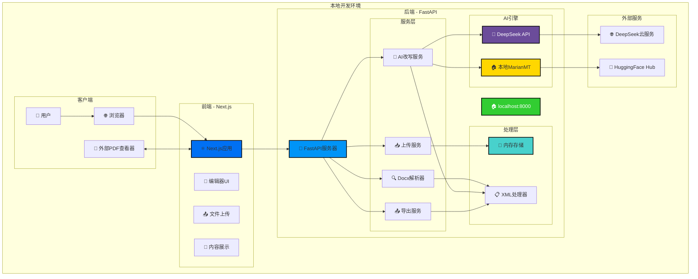
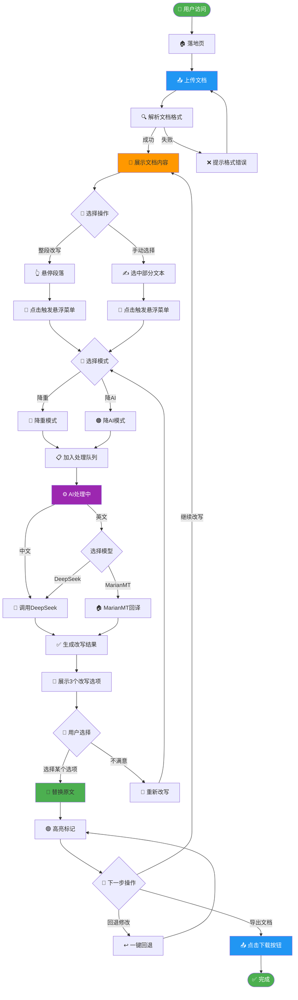

# 产品设计文档（PDD）：Grain（守拙）

**版本**：v3.1.0（Local MVP Spec）

**日期**：2026-02-03

**状态**：已实现核心链路，持续迭代中（v3.1.1）

**Slogan**：The AI Humanizer & Academic Shield.

**说明**：本版本聚焦于**本地开发部署**，完成完整的本地可运行版本。云端部署将在后续版本（v3.2.0）中实现。

------

## 1. 产品概述（Executive Summary）

### 1.1 产品定义

**Grain（守拙）**是一款**Web端**的智能文档润色编辑器。它允许用户上传Word文档，在保留原始格式（排版、引用、图片）的前提下，通过AI针对性地降低**查重率**或**AI检测率**。

### 1.2 核心差异化（USP）

1. **Format Sanctity（格式神圣）**：采用XML骨架置换技术，确保修改后的文档下载下来，格式与原稿分毫不差。

2. **External Sync（外屏协同）**：放弃内置笨重的PDF阅读器，利用用户习惯的「系统级分屏」（左侧外部PDF，右侧Grain），专注于极致的编辑体验。

3. **Dual Engine（双模引擎）**：同一套界面，提供「降重」与「降AI」两套完全不同的底层算法逻辑。

------

## 2. 核心功能与算法策略（Core Logic）

用户在上传文件或选择段落时，需明确当前的任务目标。系统根据目标调用不同的Prompt和模型策略。

### 2.1 🔴 降重模式（Fix Plagiarism）

- **适用场景**：知网（CNKI）、Turnitin标红的重复段落。

- **核心逻辑**：**「扩写与重构」**。

- **算法策略**：

  - **中文**：调用DeepSeek。指令侧重于「学术化扩写」、「主动变被动」、「同义词高级替换」。（例如：把「用了」改成「采用了……作为核心手段」）。

  - **英文**：调用DeepSeek。指令侧重于Sentence Structure Flipping（句式翻转）和Academic Vocabulary Expansion（学术词汇扩展）。

### 2.2 🟠 降AI模式（Fix AI Detection）

- **适用场景**：GPTZero、Turnitin AI检测的高风险段落。

- **核心逻辑**：**「熵增与降智」**。

- **算法策略**：

  - **中文**：调用DeepSeek。指令侧重于「口语化」、「去逻辑连接词（如『综上所述』）」、「短句化」、「增加主观语气」。

  - **英文**：默认使用DeepSeek直改；可选启用MarianMT `En -> De -> En` 回译作为噪声候选，再由用户人工选择。

------

## 3. 交互设计（UX/UI Design）

### 3.1 界面布局：沉浸式单栏（Single Column）

- **视觉风格**：极简主义，类似Notion或Typora的纯白编辑器。

- **去噪设计**：移除左右分屏，移除PDF预览。界面只展示用户上传的文档内容，最大化编辑宽度，方便用户与外部的PDF查重报告配合使用。

### 3.2 核心交互：流体式编辑（Fluid Editing）

1. **智能光标（Smart Scoping）**：

   - 无需手动框选。当鼠标悬停在某段落时，该段落左侧出现指示条`|`，表明当前操作域为「整段」。

2. **原位触发（In-place Trigger）**：

   - 点击段落，弹出悬浮菜单：`[🔴 降重] | [🟠 降 AI]`。

   - 点击后，段落下方出现**波浪形呼吸线**（Loading），此时用户可继续浏览其他内容，无需等待。

3. **结果决策（Decision Making）**：

   - AI生成完毕，呼吸线变为**结果气泡**。

   - 点击气泡，展开3个改写选项。

   - 用户点击某选项 -> **原文被直接替换**。

4. **高亮与回溯（Feedback & Undo）**：

   - **绿色高亮**：被修改过的段落背景呈浅绿色（Fade out效果或留边框），提示「已处理」。

   - **一键回退**：段落右上角常驻`↩`按钮，悬停可查看原文，点击瞬间复原。

------

## 4. 技术架构（Technical Stack）

采用**前后端分离** + **无状态（Stateless）**架构，确保MVP阶段的轻量与隐私安全。

### 4.1 本地开发架构图

### 4.2 组件说明

| **组件** | **选型** | **部署方式** | **说明** |
|----------|----------|--------------|----------|
| 前端 | Next.js（React） | **本地开发服务器** | 负责UI展示、文件上传交互，`npm run dev`启动 |
| 后端 | FastAPI（Python） | **本地Uvicorn** | 负责业务逻辑、Word解析、DeepSeek API调用；MarianMT为可选增强链路，`uvicorn main:app --reload`启动 |
| 数据库 | *无* | *无* | MVP阶段不存储用户数据，所有处理在内存（RAM）中完成 |

### 4.3 关键技术实现

1. **Word无损回填技术（The Skeleton Method）**：

   - 使用`python-docx`读取`.docx`文件。

   - **步骤一**：提取所有`<w:t>`文本节点，并生成唯一ID索引。

   - **步骤二**：将文本发送给AI处理。

   - **步骤三**：接收新文本，根据ID精准写入原XML节点。

   - **步骤四**：重新打包XML为`.docx`。

   - *结果：除文字外，字体、字号、行间距、图片位置完全不变。*

2. **本地开发调试模式**：

   - 前端Next.js运行在`http://localhost:3000`。

   - 后端FastAPI运行在`http://localhost:8000`。

   - 前端通过`NEXT_PUBLIC_API_URL=http://localhost:8000`环境变量连接后端。

   - 支持热重载（Hot Reload），代码修改后自动刷新。

3. **Ngrok公网演示（可选）**：

   - 如需对外演示，可通过Ngrok将本地后端穿透至公网。

   - 命令：`ngrok http 8000`。

   - 前端临时配置指向Ngrok地址，实现「假上线」演示。

------

## 5. 用户流程设计（User Flow）

### 5.1 核心用户流程图

### 5.2 用户操作路径说明

| **阶段** | **用户操作** | **系统响应** | **备注** |
|----------|--------------|--------------|----------|
| 访问入口 | 访问本地网址 | 展示落地页 | 包含功能介绍与上传入口 |
| 文档上传 | 点击上传按钮 | 解析文档格式 | 支持.docx格式 |
| 文档展示 | 查看解析结果 | 渲染文档内容 | 保留原始格式 |
| 选择模式 | 悬停/选中文本 | 弹出操作菜单 | 支持降重/降AI两种模式 |
| AI处理 | 确认改写 | 加入处理队列 | 支持异步处理 |
| 结果选择 | 点击改写选项 | 替换原文 | 展示3个选项供选择 |
| 导出下载 | 点击下载按钮 | 生成并下载文档 | 保留原始格式 |

------

## 6. 本地开发计划（Local Development Roadmap）

本版本专注于**本地开发部署**，目标是完成一个完整可运行的本地版本。所有里程碑均围绕本地环境定义。

### 6.1 开发时间线

以下是本地开发的完整时间线，按照7个Sprint组织，总周期约8周：

#### 📅 第一周（2026-02-03 ～ 2026-02-07）：项目初始化

| **日期** | **任务** | **工时** | **交付物** | **验收标准** |
|----------|----------|----------|------------|--------------|
| 02-03 | Git仓库创建 | 2小时 | Git仓库 | 项目目录初始化完成 |
| 02-03 | 项目结构规划 | 4小时 | 目录结构文档 | 明确前后端目录结构 |
| 02-04 | Python环境配置 | 4小时 | Python虚拟环境 | Python 3.10+ |
| 02-05 | Node.js环境配置 | 4小时 | Next.js项目 | Next.js 14+ 安装完成 |
| 02-06 | 开发工具配置 | 2小时 | VS Code配置 | 格式化、lint配置完成 |
| 02-07 | 环境联调测试 | 2小时 | 可开发环境 | 前后端均可启动 |

**里程碑🎯**：项目初始化完成，团队成员可在本地启动前后端服务。

---

#### 📅 第二周（2026-02-08 ～ 2026-02-14）：后端基础

| **日期** | **任务** | **工时** | **交付物** | **验收标准** |
|----------|----------|----------|------------|--------------|
| 02-08 | FastAPI框架搭建 | 3天 | FastAPI应用 | `uvicorn main:app --reload`可启动 |
| 02-11 | 基础API端点实现 | 2天 | API端点 | `/health`返回正常响应 |
| 02-13 | CORS配置 | 1天 | CORS中间件 | 前端可调用后端API |
| 02-14 | 开发环境联调 | 1天 | 联调验证 | 前后端正常通信 |

**里程碑🎯**：后端基础完成，可通过`http://localhost:8000/docs`访问API文档。

---

#### 📅 第三周（2026-02-15 ～ 2026-02-21）：后端Word解析

| **日期** | **任务** | **工时** | **交付物** | **验收标准** |
|----------|----------|----------|------------|--------------|
| 02-15 | docx解析器开发 | 5天 | 解析器模块 | 可读取.docx文件内容 |
| 02-20 | XML骨架提取 | 3天 | XML提取工具 | 生成唯一ID索引 |
| 02-23 | 无损回填功能 | 3天 | 回填模块 | 修改后格式不变 |

**里程碑🎯**：Word解析完成，可实现「上传 -> 解析 -> 展示 -> 修改 -> 回填 -> 下载」全流程。

---

#### 📅 第四周（2026-02-08 ～ 2026-02-17）：前端基础（并行）

| **日期** | **任务** | **工时** | **交付物** | **验收标准** |
|----------|----------|----------|------------|--------------|
| 02-08 | Next.js项目搭建 | 2天 | 前端项目 | `npm run dev`可启动 |
| 02-10 | 单栏编辑器布局 | 3天 | 编辑器UI | 类似Notion的纯白界面 |
| 02-13 | 文件上传组件 | 2天 | 上传组件 | 支持.docx文件选择 |
| 02-15 | 文档展示组件 | 2天 | 展示组件 | 正确渲染段落内容 |
| 02-17 | API对接 | 2天 | API服务层 | 前后端数据互通 |

**里程碑🎯**：前端基础完成，可通过`http://localhost:3000`访问编辑器页面。

---

#### 📅 第五周（2026-02-17 ～ 2026-02-28）：Word解析收尾 + 测试

| **日期** | **任务** | **工时** | **交付物** | **验收标准** |
|----------|----------|----------|------------|--------------|
| 02-24 | 无损回填功能（续） | 3天 | 回填模块 | 修改后格式不变 |
| 02-27 | 本地测试验证 | 2天 | 测试报告 | 10个测试用例通过 |

**里程碑🎯**：Word解析模块测试通过，格式保持功能验证完成。

---

#### 📅 第六周（2026-03-01 ～ 2026-03-07）：AI集成

| **日期** | **任务** | **工时** | **交付物** | **验收标准** |
|----------|----------|----------|------------|--------------|
| 03-01 | DeepSeek API封装 | 3天 | API封装 | 成功调用并返回结果 |
| 03-04 | MarianMT本地部署 | 5天 | 本地推理服务 | En-De-En回译正常 |
| 03-09 | 降重Prompt实现 | 3天 | Prompt库 | 查重率下降30%以上 |
| 03-12 | 降AI Prompt实现 | 3天 | Prompt库 | GPTZero通过率80%以上 |

**里程碑🎯**：AI集成完成，支持降重和降AI两种改写模式。

---

#### 📅 第七周（2026-03-10 ～ 2026-03-16）：交互完善

| **日期** | **任务** | **工时** | **交付物** | **验收标准** |
|----------|----------|----------|------------|--------------|
| 03-10 | 智能光标交互 | 2天 | 悬停效果 | 段落左侧显示指示条 |
| 03-12 | 悬浮菜单组件 | 2天 | 菜单组件 | 点击弹出操作选项 |
| 03-14 | 异步处理队列 | 2天 | 状态管理 | 波浪形Loading效果 |
| 03-16 | 结果气泡组件 | 2天 | 气泡组件 | 展示3个改写选项 |
| 03-16 | 高亮与回退功能 | 2天 | 操作历史 | 绿色高亮 + 一键回退 |

**里程碑🎯**：交互完善完成，实现完整的沉浸式编辑体验。

---

#### 📅 第八周（2026-03-17 ～ 2026-03-28）：测试与优化

| **日期** | **任务** | **工时** | **交付物** | **验收标准** |
|----------|----------|----------|------------|--------------|
| 03-17 | AI改写功能集成 | 2天 | 集成功能 | 前后端联动正常 |
| 03-19 | 功能测试 | 3天 | 测试报告 | 核心流程100%通过 |
| 03-22 | Bug修复 | 2天 | 修复记录 | 无阻塞性Bug |
| 03-24 | 性能优化 | 2天 | 优化报告 | 首屏加载小于3秒 |
| 03-26 | 响应式适配 | 2天 | 适配方案 | 移动端可正常使用 |
| 03-28 | 本地验收 | 1天 | 验收报告 | 产品负责人签字确认 |

**里程碑🎯**：本地验收通过，v3.1.0版本完成。

---

### 6.2 Sprint详细计划

#### 📦 **Sprint 1：项目初始化（2026-02-03 ～ 2026-02-07）**

**目标**：完成项目初始化，建立开发环境。

| **任务** | **工时** | **交付物** | **验收标准** | **命令/操作** |
|----------|----------|------------|--------------|---------------|
| Git仓库创建 | 2小时 | Git仓库 | 项目目录初始化完成 | `git init` |
| 项目结构规划 | 4小时 | 目录结构文档 | 明确前后端目录结构 | 创建`/frontend`、`/backend` |
| Python环境配置 | 4小时 | Python虚拟环境 | Python 3.10+，安装基础依赖 | `python -m venv venv`、`pip install fastapi uvicorn python-multipart` |
| Node.js环境配置 | 4小时 | Node.js项目 | Next.js 14+ 安装完成 | `npx create-next-app@latest frontend` |
| 开发工具配置 | 2小时 | VS Code配置 | 格式化、lint配置完成 | 安装ESLint、Prettier、Pylance |

**里程碑🎯**：项目初始化完成，团队成员可在本地启动前后端服务。

---

#### 🐍 **Sprint 2：后端基础（2026-02-08 ～ 2026-02-15）**

**目标**：完成FastAPI框架搭建，实现基础API端点。

| **任务** | **工时** | **交付物** | **验收标准** | **命令/操作** |
|----------|----------|------------|--------------|---------------|
| FastAPI框架搭建 | 3天 | FastAPI应用 | `uvicorn main:app --reload`可启动 | 创建`main.py`、`requirements.txt` |
| 基础API端点实现 | 2天 | API端点 | `/health`返回正常响应 | 创建`GET /health`、`GET /api/v1/docs` |
| CORS配置 | 1天 | CORS中间件 | 前端可调用后端API | 配置`from fastapi.middleware.cors import CORSMiddleware` |
| 开发环境联调 | 1天 | 联调验证 | 前后端正常通信 | 使用`curl`或Postman测试API |

**里程碑🎯**：后端基础完成，可通过`http://localhost:8000`访问API文档。

---

#### 📄 **Sprint 3：Word解析（2026-02-15 ～ 2026-02-28）**

**目标**：实现Word文档的解析与无损回填功能。

| **任务** | **工时** | **交付物** | **验收标准** | **命令/操作** |
|----------|----------|------------|--------------|---------------|
| docx解析器开发 | 5天 | 解析器模块 | 可读取.docx文件内容 | `pip install python-docx`，创建`parser.py` |
| XML骨架提取 | 3天 | XML提取工具 | 生成唯一ID索引 | 解析`<w:t>`节点，生成UUID |
| 无损回填功能 | 3天 | 回填模块 | 修改后格式不变 | 根据ID写入新文本，重新打包 |
| 本地测试验证 | 2天 | 测试报告 | 10个测试用例通过 | 测试字体、字号、行间距、图片 |

**里程碑🎯**：Word解析完成，可实现「上传 -> 解析 -> 展示 -> 修改 -> 回填 -> 下载」全流程。

---

#### ⚛️ **Sprint 4：前端基础（2026-02-08 ～ 2026-02-17）**

**目标**：完成Next.js单栏编辑器基础布局。

| **任务** | **工时** | **交付物** | **验收标准** | **命令/操作** |
|----------|----------|------------|--------------|---------------|
| Next.js项目搭建 | 2天 | 前端项目 | `npm run dev`可启动 | 使用TypeScript、ESLint配置 |
| 单栏编辑器布局 | 3天 | 编辑器UI | 类似Notion的纯白界面 | 创建`components/Editor.tsx` |
| 文件上传组件 | 2天 | 上传组件 | 支持.docx文件选择 | 使用`react-dropzone` |
| 文档展示组件 | 2天 | 展示组件 | 正确渲染段落内容 | 解析API返回的JSON数据 |
| API对接 | 2天 | API服务层 | 前后端数据互通 | 配置`NEXT_PUBLIC_API_URL` |

**里程碑🎯**：前端基础完成，可通过`http://localhost:3000`访问编辑器页面。

---

#### 🧠 **Sprint 5：AI集成（2026-02-15 ～ 2026-03-08）**

**目标**：集成DeepSeek API和MarianMT本地模型，实现核心改写功能。

| **任务** | **工时** | **交付物** | **验收标准** | **命令/操作** |
|----------|----------|------------|--------------|---------------|
| DeepSeek API封装 | 3天 | API封装 | 成功调用并返回结果 | `pip install openai`，创建`deepseek.py` |
| MarianMT本地部署 | 5天 | 本地推理服务 | En-De-En回译正常 | `pip install transformers torch`，下载模型 |
| 降重Prompt实现 | 3天 | Prompt库 | 查重率下降30%以上 | 创建`prompts/plagiarism_fix.py` |
| 降AI Prompt实现 | 3天 | Prompt库 | GPTZero通过率80%以上 | 创建`prompts/humanizer.py` |
| AI改写功能集成 | 2天 | 集成功能 | 前后端联动正常 | 创建`/api/v1/rewrite`端点 |

**里程碑🎯**：AI集成完成，支持降重和降AI两种改写模式。

---

#### 🎨 **Sprint 6：交互完善（2026-03-10 ～ 2026-03-18）**

**目标**：实现沉浸式编辑体验的交互细节。

| **任务** | **工时** | **交付物** | **验收标准** | **命令/操作** |
|----------|----------|------------|--------------|---------------|
| 智能光标交互 | 2天 | 悬停效果 | 段落左侧显示指示条 | CSS`:hover`+React State |
| 悬浮菜单组件 | 2天 | 菜单组件 | 点击弹出操作选项 | 创建`components/FloatingMenu.tsx` |
| 异步处理队列 | 2天 | 状态管理 | 波浪形Loading效果 | 使用React Query或Zustand |
| 结果气泡组件 | 2天 | 气泡组件 | 展示3个改写选项 | 创建`components/ResultBubble.tsx` |
| 高亮与回退功能 | 2天 | 操作历史 | 绿色高亮 + 一键回退 | 存储原文快照，创建`UndoButton.tsx` |

**里程碑🎯**：交互完善完成，实现完整的沉浸式编辑体验。

---

#### ✅ **Sprint 7：测试与优化（2026-03-20 ～ 2026-03-28）**

**目标**：完成功能测试、Bug修复和性能优化。

| **任务** | **工时** | **交付物** | **验收标准** | **命令/操作** |
|----------|----------|------------|--------------|---------------|
| 功能测试 | 3天 | 测试报告 | 核心流程100%通过 | 编写测试用例，手动+自动化 |
| Bug修复 | 2天 | 修复记录 | 无阻塞性Bug | 使用`console.log`、DevTools调试 |
| 性能优化 | 2天 | 优化报告 | 首屏加载小于3秒 | 代码分割、懒加载、图片优化 |
| 本地验收 | 1天 | 验收报告 | 产品负责人签字确认 | 演示完整功能流程 |

**里程碑🎯**：本地验收通过，v3.1.0版本完成。

---

### 6.3 关键里程碑节点

| **日期** | **里程碑** | **交付物** | **验收方式** |
|----------|------------|------------|--------------|
| 2026-02-07 | 🎯 里程碑1：项目初始化完成 | Git仓库 + 开发环境 | 团队成员可克隆并启动项目 |
| 2026-02-15 | 🎯 里程碑2：后端基础完成 | 可访问API文档 | 访问`http://localhost:8000/docs` |
| 2026-02-17 | 🎯 里程碑3：前端基础完成 | 编辑器页面可访问 | 访问`http://localhost:3000` |
| 2026-02-28 | 🎯 里程碑4：Word解析完成 | 可解析.docx文件 | 上传文档并正确展示 |
| 2026-03-08 | 🎯 里程碑5：AI集成完成 | 支持降重/降AI | 测试改写功能，验证效果 |
| 2026-03-18 | 🎯 里程碑6：交互完善完成 | 沉浸式编辑器 | 体验完整交互流程 |
| 2026-03-28 | 🎯 里程碑7：本地验收通过 | v3.1.0版本发布 | 产品负责人验收签字 |

---

### 6.4 每日开发检查清单

在本地开发过程中，每日应检查以下事项：

- [ ] 代码是否已提交Git（至少每日一次）

- [ ] 新增功能是否有对应的测试用例

- [ ] API端点是否有文档说明

- [ ] 前端组件是否有良好的错误处理

- [ ] 是否有内存泄漏或性能问题

- [ ] 开发环境与生产环境配置是否分离

---

### 6.5 本地开发环境要求

| **软件** | **版本要求** | **说明** |
|----------|--------------|----------|
| Python | 3.10+ | 建议使用3.11 |
| Node.js | 18+ LTS | 建议使用20 LTS |
| Git | 2.40+ | 版本控制 |
| pip | 23.0+ | Python包管理 |
| npm | 9.0+ | Node包管理 |
| uv | 可选 | 更快Python包管理 |

---

### 6.6 启动命令速查

| **操作** | **命令** | **访问地址** |
|----------|----------|--------------|
| 启动后端 | `cd backend && uvicorn main:app --reload` | http://localhost:8000 |
| 启动前端 | `cd frontend && npm run dev` | http://localhost:3000 |
| 查看API文档 | - | http://localhost:8000/docs |
| 安装后端依赖 | `cd backend && pip install -r requirements.txt` | - |
| 安装前端依赖 | `cd frontend && npm install` | - |
| 运行后端测试 | `cd backend && pytest` | - |
| 运行前端测试 | `cd frontend && npm test` | - |

------

## 7. 云端部署路线图（后续版本）

以下内容将在**v3.2.0版本**中实现，本版本仅关注本地开发。

### 7.1 预计任务

| **任务** | **工时** | **交付物** | **说明** |
|----------|----------|------------|----------|
| Docker容器化 | 5天 | Dockerfile | 本地可构建镜像 |
| 后端云端部署 | 3天 | Zeabur部署 | 公网API端点 |
| 前端云端部署 | 3天 | Netlify部署 | 公网站点 |
| 域名配置 | 2天 | grain.ai解析 | 自定义域名 |
| 安全加固 | 2天 | 安全策略 | CORS、RateLimit |

### 7.2 预计时间

**云端部署预计开始时间**：2026-03-29（v3.1.0验收通过后）。

**云端部署预计完成时间**：2026-04-12（两周）。

---

## 8. 附录：核心Prompt示例

**场景一：中文降重（Chinese Plagiarism Fix）**

> 「你是一个资深学术编辑。请对以下段落进行【深度降重】。
>
> 1. **结构重组**：彻底打乱原有语序，将主动语态改为被动，或反之。
>
> 2. **学术扩写**：将原句长度扩充1.3倍以上，引入更严谨的学术限定词（如：『从某种程度上说』 -> 『基于现有实证数据分析可知』）。
>
> 3. **同义替换**：将高频词替换为低频学术词汇。
>
>    **输入文本**：{text}
>
>    **输出要求**：仅输出改写后的文本，不要解释。」

**场景二：英文降AI（English Humanizer）**

> 「Rewrite the following text to bypass AI detectors.
>
> 1. **Burstiness**: Mix very short, punchy sentences with longer, complex ones.
>
> 2. **Imperfection**: Occasionally start sentences with conjunctions（And, But, So）. Use colloquial transitions instead of formal ones（remove 'Furthermore', 'Consequently'）.
>
> 3. **Perspective**: Inject a slight subjective tone or opinion where appropriate.
>
>    **Input**: {text}」

------

*文档版本：v3.1.0*
*最后更新：2026-02-03*
*作者：Matrix Agent*
*说明：聚焦本地开发部署，云端部署请参考v3.2.0版本*
